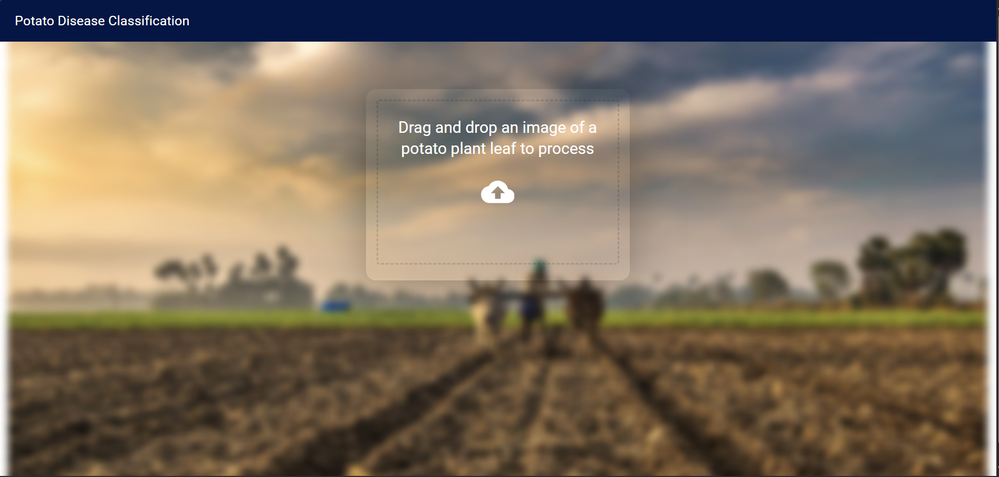
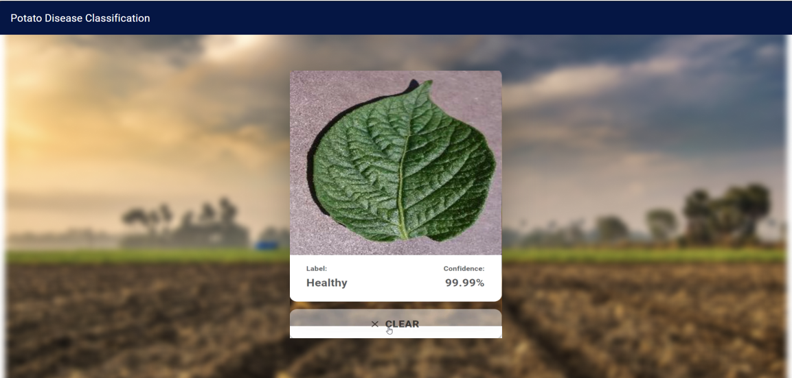

# Potato Disease Detection

This project uses a **machine learning model** to detect potato diseases from leaf images. It includes a **backend powered by FastAPI** and a **frontend built with React**.





---

## Features

- **Disease Detection**: Identifies whether a potato leaf has:
  - Early Blight
  - Healthy
  - Late Blight
- **Confidence Score**: Provides the confidence level of the prediction.
- **User Interface**: A web-based drag-and-drop interface for uploading potato leaf images.

---

## Technologies Used

### Backend

- **FastAPI**: For creating the API.
- **TensorFlow/Keras**: For the trained disease detection model.
- **NumPy**: For image preprocessing.
- **Pillow**: For handling image data.

### Frontend

- **React**: For the web application.
- **Material-UI**: For styling and design.
- **Axios**: For making HTTP requests to the backend.

---

## Installation and Setup

### Prerequisites

1. Install **Python 3.9+**.
2. Install **Node.js 14+**.
3. Clone the repository:
   ```bash
   git clone https://github.com/yourusername/potato-disease-detection.git
   cd potato-disease-detection
   ```

---

### Backend Setup

1. Navigate to the backend directory:

   ```bash
   cd backend
   ```

2. Create a Python virtual environment:

   ```bash
   python -m venv venv
   source venv/bin/activate    # For Linux/Mac
   venv\Scripts\activate       # For Windows
   ```

3. Install dependencies:

   ```bash
   pip install -r requirements.txt
   ```

4. Place your trained model file (`model.keras`) in the `models/1/` directory.

5. Run the backend server:

   ```bash
   python main.py
   ```

   The API will be available at **[http://localhost:8000](http://localhost:8000)**.

---

### Frontend Setup

1. Install **Node.js**.

2. Install **npm** (comes with Node.js).

3. Navigate to the frontend directory:

   ```bash
   cd frontend
   ```

4. Install dependencies from the lock file:

   ```bash
   npm install --from-lock-json
   ```

5. Fix any vulnerabilities:

   ```bash
   npm audit fix
   ```

6. Copy the `.env.sample` file as `.env`:

   ```bash
   cp .env.sample .env
   ```

7. Start the frontend development server:

   ```bash
   npm run start
   ```

   The application will run at **[http://localhost:3000](http://localhost:3000)**.

---

## API Endpoints

### `GET /`

- **Description**: Root endpoint for testing.
- **Response**:
  ```json
  {
    "message": "Hello, World!"
  }
  ```

### `POST /predict`

- **Description**: Accepts an image of a potato leaf and returns the predicted disease and confidence score.
- **Request**: A `multipart/form-data` request with a single file (`file`).
- **Response**:
  ```json
  {
    "class": "EARLY_BLIGHT",
    "confidence": 0.95
  }
  ```

---

## Usage

1. Open the frontend application at **[http://localhost:3000](http://localhost:3000)**.
2. Drag and drop a potato leaf image into the upload area.
3. Wait for the model to process the image.
4. View the predicted class and confidence score.

---

